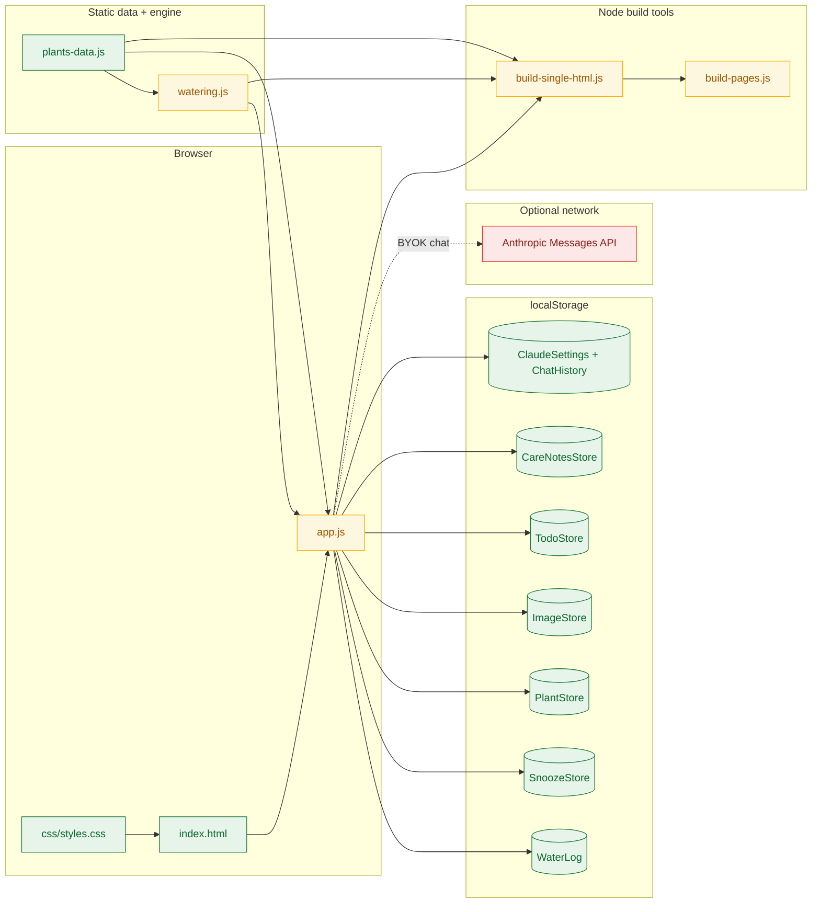

# Cowboy Bebop Green House — developer guide

*plant-care / developer-guide-structure-and-features*

## Metadata

| Attribute | Details |
|---|---|
| Audience | Developers / maintainers (including AI coding agents) |
| Scope | Architecture, **core logic & algorithms**, data model, features, build/deploy |
| Last updated | 2026-07-22 (algorithms pass) |
| Owner | Personal POC — `Personal_POC/Plant_Care` |
| Companion doc | [`project-requirements-and-handoff.md`](./project-requirements-and-handoff.md) — inventory, edit recipes, session logs |

This guide explains **how the app is structured, how non-trivial client-side algorithms work, and how each feature is wired in code**. Everything in §3 ships in the GitHub Pages static bundle (`js/*.js` inlined or copied as-is). The handoff doc remains the authoritative plant inventory and agent edit cheat sheet.

---

## 1. What this app is

**Cowboy Bebop Green House** is a fully offline-capable **static** personal plant-care web app:

- Pure **HTML + CSS + vanilla JavaScript** — no framework, no transpilation, no backend required to run.
- Tracks **36 owned plants** with research-backed care data, watering schedules, placement, soil tracking, todos, and optional BYOK Claude chat.
- Dual-themed UI: light green palette and dark Cowboy Bebop–inspired palette.
- Runs on desktop or phone via folder open, local HTTP server, single-file build, or GitHub Pages deploy copy.

**Source of truth:** `c:\Users\szfy8z\Personal_POC\Plant_Care\`

**Deploy copy (generated):** `c:\Users\szfy8z\Personal_POC\plant-care-site\` — synced via `tools/build-pages.js`.

---

## 2. Architecture overview



### Layer responsibilities

| Layer | File(s) | Responsibility |
|---|---|---|
| Shell | `index.html` | Tab nav, seven tab panels, form markup, script load order |
| Presentation | `css/styles.css` | Mobile-first layout, light/dark themes via `[data-theme]`, component styles |
| Domain data | `js/plants-data.js` | `PLANTS`, `SOIL_TYPES`, placement maps, static config arrays |
| Schedule engine | `js/watering.js` | Seasonal intervals, `nextWatering`, `buildSchedule`, all `*Store` persistence except images/theme |
| UI orchestration | `js/app.js` | Tab switching, every `render*()` function, Claude module, import/export, gestures |
| Build | `tools/*.js` | Single-file bundle + GitHub Pages sync (Node only; not required at runtime) |

### Script load order (critical)

```html
<script src="js/plants-data.js"></script>
<script src="js/watering.js"></script>
<script src="js/app.js"></script>
```

`watering.js` expects globals from `plants-data.js`. `app.js` wraps everything in an IIFE and calls `init()` on load.

---

## 3. Core logic & algorithms

This section documents the **non-trivial algorithms that run in the browser** on every visit to the GitHub Pages site. Build-time tooling is covered in **§3.9** only.

### 3.1 Three-tier seasonal watering (`nextWatering`) — `js/watering.js`

**Calibration:** `SEASONAL_CONFIG.location = "Austin, TX (indoor, 75–80°F)"`. Indoor constant temperature means hot vs warm intervals differ by ~10–15%; the larger shift is cool season (shorter daylight → longer intervals).

**Season selection** — `seasonForDate(date)` reads `MONTH_SEASONS[date.getMonth()]`:

| Index | Month | Season | Interval source |
|---|---|---|---|
| 0, 1, 11 | Jan, Feb, Dec | `cool` | `plant.wateringDaysCool` |
| 2–4, 9, 10 | Mar–May, Oct, Nov | `warm` | `plant.wateringDays` |
| 5–8 | Jun–Sep | `hot` | `plant.wateringDaysHot`, or `round(wateringDays × 0.88)` if hot missing |

**Interval pick** — `intervalForDate(plant, date)` delegates to the row above.

**`nextWatering(plantId, logEntries, explicitPlant)` step list:**

1. Resolve plant from `explicitPlant` (merged custom/overlay from `PlantStore.allPlants()`) or `PLANTS[plantId]`.
2. Early exit if no `wateringDays` / `wateringDaysCool` (custom without intervals → `{ status: "due", daysUntil: 0 }`).
3. **Read snooze once** — `SnoozeStore.get(plantId)` → `snoozeDays` (must run before both branches; see comment at L211–216).
4. Sort log entries for plant descending; take most recent as `last`.
5. **No-log branch** (`actuals.length === 0`):
   - `baseNext = today`
   - `nextNoLog = today + snoozeDays` if snoozed
   - Status: `due` if `daysUntil ≤ 0`, else `soon` if `≤ 3`, else `scheduled` (note: no `overdue` without a log)
6. **Has-log branch**:
   - `interval = intervalForDate(plant, last)` — season of **last watering date**
   - `next = last + interval`
   - If snoozed: `baseForSnooze = (next < today) ? today : next`; then `next = baseForSnooze + snoozeDays` (“don’t bug me for N days from now”)
   - `daysUntil = daysBetween(today, next)`
   - Status: `overdue` if `< 0`, `due` if `0`, `soon` if `≤ 3`, else `scheduled`
7. Return `{ lastDate, nextDate, daysUntil, status, interval, season, snooze }`.

**`buildSchedule()`** projects all of 2026 from the last log (or Jan 1 baseline). Snooze shifts only the **first** projected date; if that date is past, snap to `today + snoozeDays` (same overdue fix as `nextWatering`).

See also: [`diagrams/watering-schedule-flow.mmd`](./diagrams/watering-schedule-flow.mmd).


### 3.2 Additive snooze + scroll-safe tap gestures — `SnoozeStore` + `app.js`

**Storage** (`js/watering.js` → `SnoozeStore`):

```
Shape: { [plantId]: { addDays: number, snoozedAt: "YYYY-MM-DD" } }
SnoozeStore.add(plantId, days) → addDays += days  (additive — +3 then +4 = +7)
WaterLog.add({ plantId }) → SnoozeStore.clear(plantId)
```

**Why gesture detection exists:** Samsung Internet on Android had a history of unreliable `click` on dynamically re-rendered snooze buttons (non-first tiles). Early fix used `pointerdown`-only firing, which **snoozed on scroll** when the finger started on a button. Current design tracks a full gesture.

**Handler** (`wireSnoozeHandlers` on `#next-water-summary` and `#plant-detail` — stable parents survive `innerHTML` re-renders):

| Constant / state | Value | Role |
|---|---|---|
| `TAP_MOVE_THRESHOLD` | 10 px | Cancel gesture if finger moved (scroll, not tap) |
| `TAP_TIME_THRESHOLD` | 600 ms | Ignore long-press |
| `snoozeGesture` | `{ pointerId, btn, x, y, t }` | Active gesture tracker |
| `lastSnoozeFireAt` | timestamp | Dedupe pointerup vs click fallback (700 ms window) |

**Fire conditions** (`handleSnoozePointerUp`):

1. Same `pointerId` as `pointerdown`
2. Elapsed `< 600` ms
3. `pointerup` target is the **same** `.snooze-btn` as `pointerdown`
4. `pointermove` did not exceed 10 px; `pointercancel` / `pointerleave` did not clear state

**Fallback:** `handleSnoozeClickFallback` on `click` for keyboard/mouse; skipped if pointer path fired within 700 ms.

**No same-button debounce** — additive snooze is intentional. Only dedupe is pointerup ↔ click for one physical tap.

**On fire:** `fireSnooze()` → `SnoozeStore.add/clear` → `renderCalendar()` + `refreshPlantWateringSectionIfVisible(id)`.

### 3.3 Calendar urgency ordering + auto re-queue — `renderNextSummary()` — `app.js`

```
candidateIds = ownedIds, filtered by plant dropdown and/or "logged on" date filter
meta = candidateIds.map(pid => ({ pid, plant, nx: nextWatering(pid, log, plant) }))
meta.sort((a, b) => {
  if (a.nx.daysUntil !== b.nx.daysUntil) return a.nx.daysUntil - b.nx.daysUntil  // ASC → most overdue first
  return Intl.Collator({ sensitivity: "base", numeric: true }).compare(displayNames)
})
```

Negative `daysUntil` = overdue; zero = due today; positive = future. **No extra re-queue logic** — snooze increases `daysUntil`; logging resets the cycle from the new last date; both flow through `nextWatering()` and the sort repositions the tile on the next render.

### 3.4 Custom-plant → built-in merge — `migrateCustomToBuiltins()` + `PlantStore` — `app.js`

**Merge view** — always use `PlantStore.allPlants()`, never raw `PLANTS`:

```
merged = { ...PLANTS }
customPlants.forEach(p => merged[p.id] = p)           // user_* entries overlay keys
overlays.forEach((ov, id) => merged[id] = { ...merged[id], ...ov })  // condition, pot, soil, comments
images.forEach((url, id) => merged[id].imageDataUrl = url)
```

Built-in research fields (tips, intervals, sources) come from `PLANTS`; user edits land in overlays or custom entries only.

**Migration** (first call in `init()`, idempotent):

1. Build lookup: normalized `displayName` + all `names.common[]` → built-in id (`normalize`: lowercase, strip punctuation).
2. For each `user_*` custom where normalized name matches a built-in:
   - **Overlay patch** (only if built-in overlay field empty): `condition`, `comments`, `potSize` (if ≠ built-in default), `currentSoilMix` (if ≠ `"pending"`)
   - **Image:** move `ImageStore` from custom id → built-in id
   - **Water log:** repoint `plantId` on all entries
   - **Snooze:** migrate if built-in has none
   - **Remove** custom plant + orphan overlay
3. Toast + `console.info` on first merge.

Agent workflow: add full entry to `PLANTS` + `OWNED_PLANT_IDS`; user’s next page load auto-merges.

### 3.5 Tile name → Care Guide navigation — `openCareGuideForPlant()` — `app.js`

Care Guide uses a **two-level selector**: flat owned list + group entries `__group_succulent__` / `__group_pothos__` with sub-dropdowns for variants.

```
if plantId ∈ SUCCULENT_VARIANTS:
  primarySelect = GROUP_SUCC; populateSubSelect; subSelect = plantId
else if plantId ∈ POTHOS_VARIANTS:
  primarySelect = GROUP_POTH; populateSubSelect; subSelect = plantId
else:
  primarySelect = plantId; hide sub-dropdown
renderPlantDetail(plantId); switch to care tab; scrollIntoView(detailEl)
```

**Why three paths:** variant plants are not top-level primary options — they live under group headers to keep the main dropdown short. Calendar tile links (`.tile-name-link`, delegated on `#next-water-summary`) must resolve the same UX as manually picking from both dropdowns.

### 3.6 Soil recommendation engine — `evaluateSoil()` — `app.js`

Input: merged plant with `currentSoilMix` and `idealSoil[]` (keys into `SOIL_TYPES`).

```
if current === "pending"           → status pending
if current ∈ idealSoil[]           → ideal
else for each ideal type:
  RANK = { low:1, medium:2, high:3, very_high:4, controlled:2 }
  acceptable if (drainage exact AND retention within 1 step) OR (retention exact AND drainage within 1 step)
if any acceptable                  → acceptable
else                               → mismatch
```

The dual-constraint rule prevents false positives (e.g. standard potting “acceptable” for mini orchid because both share medium drainage with sphagnum).

### 3.7 Placement engine — `PLANT_PLACEMENT` + `buildPlacementByZone()` — `app.js`

**Static data** (`plants-data.js`): each owned plant has `{ ideal: zoneId[], ok: zoneId[], avoid: zoneId[], rationale }` against eight `PLACEMENT_ZONES` entries (light profile, humidity, cautions).

**By Room view** — `buildPlacementByZone()` inverts the map:

```
for each zoneId: { ideal: [], ok: [] }
for each (plantId, rec) in PLANT_PLACEMENT:
  rec.ideal.forEach(z => byZone[z].ideal.push(plantId))
  rec.ok.forEach(z    => byZone[z].ok.push(plantId))
```

Render zone cards with sorted plant name chips. **By Plant view** — iterate `ownedIds`; render ideal/ok zone chips + avoid tags + rationale paragraph. Filter dropdown scopes the active view; filters persist per view in `placementFilterByView`.

### 3.8 Claude chat client — `app.js` (+ stores in `watering.js`)

**System prompt** — `buildClaudeSystemPrompt(plantContextId)`:

- Base instructions: Austin indoor 75–80°F, concise style, use owner’s actual data.
- `"ALL"`: compact list of all owned plants + watering status from `nextWatering()`.
- Specific plant id: pot, soil, condition, comments, last log, next due, ideal placement zones, open todos, cross-reference list.
- `"NONE"`: base instructions only.

**Send pipeline** — `sendChatMessage()`:

1. `buildClaudeSystemPrompt(chatPlantContextSel.value)`
2. Build user content: optional image block + text (`CHAT_MAX_HISTORY = 30` turns trimmed via `buildApiMessagesFromHistory`)
3. `POST https://api.anthropic.com/v1/messages` with `stream: true`, header `anthropic-dangerous-direct-browser-access: true`
4. **SSE parse** — manual loop on `resp.body.getReader()`:
   - Buffer chunks; split on `\n\n`
   - Parse `data: {...}` lines
   - `message_start` → capture `input_tokens`
   - `content_block_delta` + `text_delta` → append to `assistantText`, `renderStreamingTextInto()`
   - `message_delta` → capture `output_tokens`
5. `chatComputeCost(usage, modelId)` → `(inTok/1e6)*inUSD + (outTok/1e6)*outUSD` from `CLAUDE_MODELS` in `plants-data.js`
6. Persist usage + cost on assistant message; `ChatHistory.totalCost()` in footer

**Image pipeline** — `resizeImageFile(file, maxDim, quality)`:

```
FileReader → Image → canvas scale min(maxDim/w, maxDim/h, 1) → toDataURL("image/jpeg")
Profile photos: maxDim 800, quality 0.85
Chat photos:    maxDim 1568 (CHAT_PHOTO_MAX_DIM), quality 0.82
API payload: { type: "image", source: { type: "base64", media_type, data } }
```

**BYOK security model:** Key lives only in `localStorage` on the user’s device. The “dangerous” header flags shipping a **shared** key in a public bundle — safe here because each user supplies their own key; file is personal static HTML. Not exported in JSON backup.

### 3.9 Build-time artifact production — `tools/` *(not shipped in runtime JS)*

**`build-single-html.js`:**

1. Read `index.html`, `css/styles.css`, three JS files
2. Replace `<link href="css/styles.css">` with inline `<style>`
3. Replace three `<script src="js/...">` tags with one `<script>` block (order preserved: plants-data → watering → app)
4. Escape `</script>` in JS source
5. Sanity-check no relative asset refs remain
6. Write `dist/Cowboy-Bebop-Green-House.html`

**`build-pages.js`:**

1. Copy runtime files from `Plant_Care/` → sibling `plant-care-site/` per `COPIES` table
2. Single-file build lands at `offline/Cowboy-Bebop-Green-House.html`
3. Does **not** touch `.github/`, `.nojekyll`, deploy README, or git history

---

## 4. Tech stack

| Concern | Choice | Notes |
|---|---|---|
| Runtime | Browser ES5+ vanilla JS | No bundler; globals + IIFE |
| Styling | CSS custom properties | Themes via `html[data-theme]` |
| Persistence | `localStorage` | All user data; JSON export for portability |
| Calendar year | Hard-coded `YEAR = 2026` | In `watering.js` |
| Optional AI | Anthropic Messages API (SSE) | BYOK; browser-direct with official header |
| Build tools | Node.js (`fs`, `path`) | `tools/build-single-html.js`, `tools/build-pages.js` |
| Spreadsheet import | `xlsx` (dev-only) | `tools/read-plant-data.js` — one-off seeding |

---

## 5. Repository layout

```
Plant_Care/
├── index.html                          # Main page — tabs, panels, forms
├── README.md                           # User-facing run/edit guide
├── css/styles.css                      # All styling (light + dark)
├── js/
│   ├── plants-data.js                  # PLANTS + static config (primary edit target)
│   ├── watering.js                     # Schedule engine + TodoStore, Claude stores, etc.
│   └── app.js                          # UI, Claude chat, import/export (~3.5k lines)
├── data/
│   ├── watering-log.json               # Empty starter template
│   ├── images/                         # Optional portable JPG photos per plantId
│   └── exported_data/                  # User JSON exports (git-ignored in deploy)
├── dist/Cowboy-Bebop-Green-House.html  # Single-file mobile build
├── docs/
│   ├── project-requirements-and-handoff.md
│   ├── developer-guide-structure-and-features.md   # this file
│   └── diagrams/                       # Mermaid sources
└── tools/
    ├── build-single-html.js
    ├── build-pages.js
    └── read-plant-data.js
```

---

## 6. Application bootstrap

On every page load, `init()` in `app.js` runs this sequence:

```mermaid
sequenceDiagram
    autonumber
    participant Browser
    participant app.js
    participant watering.js
    participant plants-data.js
    participant localStorage

    Browser->>app.js: Load scripts (plants-data → watering → app)
    app.js->>app.js: loadTheme()
    app.js->>app.js: migrateCustomToBuiltins()
    app.js->>localStorage: Read custom plants, overlays, images, log, snoozes
    app.js->>plants-data.js: Match custom displayName to built-in PLANTS
    app.js->>localStorage: Migrate overlays, images, log ids; remove custom
    app.js->>app.js: populate*Select() for all tabs
    app.js->>watering.js: nextWatering / buildSchedule for calendar
    app.js->>app.js: renderCalendar, renderSoilTab, renderPlacementTab, renderTodosTab, renderChatTab
    app.js-->>Browser: Interactive UI ready
```

**First call:** `migrateCustomToBuiltins()` — prevents duplicate `(custom)` entries after an agent promotes a user plant into `PLANTS`. Idempotent; shows a one-time toast when merges occur.

**Default tab:** `calendar` (Watering Calendar). `renderCalendar()` runs unconditionally so tiles are visible before any tab click.

---

## 7. Data model

### 7.1 Built-in plant schema (`PLANTS` in `plants-data.js`)

Every owned plant is a key in the `PLANTS` object. Required and common fields:

| Field | Type | Purpose |
|---|---|---|
| `id` | string | Must match object key |
| `displayName` | string | UI title (unique identifier only — no pot/cutting counts in title) |
| `potSize` | string | e.g. `'6.5"'` or `"Water propagation"` |
| `category` | string | Badge + category defaults for custom plants |
| `names.common` | string[] | Alternate common names |
| `names.scientific` | string | Scientific name |
| `wateringDays` | number | Warm-season interval (days) |
| `wateringDaysHot` | number | Hot-season interval (Jun–Sep) |
| `wateringDaysCool` | number | Cool-season interval (Dec–Feb) |
| `conditions` | object | `{ light, temperature, humidity, soilMoisture }` each with `ideal` + `passing` |
| `tips` | object | Eight sections: lighting, soil, watering, pruning, propagation, repotting, feeding, troubleshooting |
| `sources` | `{label, url}[]` | **Minimum 5** reputable citations per plant |
| `idealSoil` | string[] | Keys into `SOIL_TYPES` |
| `currentSoilMix` | string | User-facing default; overridden by overlay |
| `soilNotes` | string? | Shown on Soil Mix tab |
| `comments` | string? | Free-text owner notes |
| `repotSigns` | string[] | Universal collapsible “signs it's time to repot” (all 36 plants) |
| `repotSuggestion` | object? | Nursery-pot plants only — urgency, target pot/soil, technique |
| `isPropagation` | boolean? | Water-rooting mode |
| `cuttingsCount` | number? | Cuttings in container (propagation or multi-cutting pots) |
| `composition` | string? | e.g. pothos combo breakdown |
| `transferPlan` | object? | Water → soil graduation plan (`potSize`, `soilType`, `summary`, `alternatives[]`) |
| `isVariant` / `variantGroup` | boolean / string? | Succulent or pothos sub-dropdown grouping |

**Control arrays** (bottom of `plants-data.js`):

| Array | Controls |
|---|---|
| `OWNED_PLANT_IDS` | Which plants appear in dropdowns and calendar |
| `SUCCULENT_VARIANTS` | Sub-dropdown under “🌵 Succulents” |
| `POTHOS_VARIANTS` | Sub-dropdown under “🌿 Pothos” |
| `WATER_PROPAGATION_IDS` | Currently `[]` — schema ready for future cuttings |

### 7.2 Soil catalog (`SOIL_TYPES`)

Each soil type has `label`, `drainage`, `retention`, `description`. Used by Soil Mix tab and profile form. Keys include `standard_potting`, `amended_potting`, `cactus_mix`, `aroid_mix`, `terrarium_mix`, `water_propagation`, `pending`, `other`, etc.

Status logic: see **§3.6** (`evaluateSoil`).

### 7.3 Placement model

| Object | Location | Shape |
|---|---|---|
| `PLACEMENT_ZONES` | `plants-data.js` | 8 home micro-zones with light/humidity profiles |
| `PLANT_PLACEMENT` | `plants-data.js` | Per plant: `ideal[]`, `ok[]`, `avoid[]`, `rationale` |
| `PLACEMENT_SOURCES` | `plants-data.js` | 9 cited horticultural sources |

Rendering logic: see **§3.7**.

### 7.4 localStorage stores

| Store | Key | Module | Exported? |
|---|---|---|---|
| Theme | `plant_care_theme` | `app.js` | No |
| Water log | `plant_care_water_log_v1` | `watering.js` → `WaterLog` | Yes |
| Snoozes | `plant_care_snoozes_v1` | `watering.js` → `SnoozeStore` | Yes |
| Custom plants | `plant_care_custom_plants_v1` | `app.js` → `PlantStore` | Yes |
| Built-in overlays | `plant_care_plant_overlays_v1` | `app.js` → `PlantStore` | Yes |
| Photos | `plant_care_images_v1` | `app.js` → `ImageStore` | Yes |
| Todos | `plant_care_todos_v1` | `watering.js` → `TodoStore` | Yes |
| Claude settings | `plant_care_anthropic_settings_v1` | `watering.js` → `ClaudeSettings` | **No** (device-local BYOK) |
| Chat history | `plant_care_chat_history_v1` | `watering.js` → `ChatHistory` | **No** |
| Care notes | `plant_care_care_notes_v1` | `watering.js` → `CareNotesStore` | Yes |

**Overlay fields** on built-ins: `condition`, `comments`, `potSize`, `currentSoilMix`, photo (via `ImageStore`). Tips, intervals, and sources are **not** overlay-editable — edit `plants-data.js`.

**Snooze shape:** see **§3.2**.

**Todo shape:** `{ id, plantId?, title, category, dueDate?, notes?, completedAt?, createdAt }`.

**Care note shape:** `{ id, plantId, title, text, source, model, createdAt }` — archived from Claude chat.

### 7.5 JSON export / import

Export payload (Log & Data tab):

```js
{
  waterLog, customPlants, overlays, images,
  snoozes, todos, careNotes, exportedAt
}
```

Import accepts a bare array (legacy water log only) or the full object. Claude API key and chat history are intentionally excluded.

---

## 8. Watering schedule engine (reference)

Full algorithm: **§3.1**. Core API surface in `js/watering.js`:

| Function | Returns | Used by |
|---|---|---|
| `intervalForDate(plant, date)` | Days for that month’s season | Schedule projection |
| `buildSchedule(plantId, log, plant?)` | `{date, type}[]` for 2026 | Calendar grid |
| `nextWatering(plantId, log, plant?)` | `{ lastDate, nextDate, daysUntil, status, interval }` | Watering tiles |
| `Dates.*` | ISO/pretty date helpers | All tabs |

Intervals are research-based, not user-editable. Snooze + calendar projection: **§3.1**, **§3.2**, **§3.3**.

---

## 9. UI architecture

### 9.1 Tab system

Seven tabs in `index.html` nav; `data-tab` attribute drives switching in `app.js`:

| Tab id | Label | Default? | Primary render function |
|---|---|---|---|
| `calendar` | 📅 Watering Calendar | **Yes** | `renderCalendar()` |
| `todos` | ✅ Todos | | `renderTodosTab()` |
| `care` | 📖 Care Guide | | `renderPlantDetail()` |
| `chat` | 🤖 Ask Claude | | `renderChatTab()` |
| `soil` | 🪴 Soil Mix | | `renderSoilTab()` |
| `placement` | 📍 Placement | | `renderPlacementTab()` |
| `log` | 💧 Log & Data | | `renderRecentLog()` |

Tab activation re-renders the target tab (lazy refresh pattern).

### 9.2 Shared watering tile — `renderWaterTileHtml()`

Single helper in `app.js` renders the 💧 next-watering card for:

- Calendar tab — `renderNextSummary()` — urgency sort per **§3.3**
- Care Guide — `renderPlantWateringSection()` with `{ includeName: false }`

Each tile includes status badge, last/next dates, snooze shift line, snooze buttons, and `.tile-name-link` → **§3.5**.

### 9.3 Cross-tab navigation helpers

| Function | Behavior |
|---|---|
| `openCareGuideForPlant(plantId)` | Three-way selector resolution — **§3.5** |
| `openChatForPlant(plantId)` | Pre-selects plant context in Claude tab; focuses input |
| `openTodosForPlant(plantId)` | Sets todo filter; switches to Todos tab |

### 9.4 Snooze gesture handling

Full algorithm: **§3.2**. Handlers wired once on stable `#next-water-summary` and `#plant-detail` parents.

### 9.5 Care Guide render pipeline (`renderPlantDetail`)

Renders in order:

1. Meta header (pot, cuttings, condition, category)
2. Photo (folder `data/images/<id>.jpg` first, then `ImageStore` fallback)
3. Action pills (todos manage, Ask Claude)
4. Notes from past chats (`CareNotesStore`)
5. 💧 Next watering tile (shared helper)
6. 👀 Repot signs (`repotSigns` — collapsible `<details>`)
7. 🪴 Repot suggestion card (`repotSuggestion` — urgency-colored)
8. 📦 Transfer plan (water propagations only)
9. Conditions card
10. Tip accordions (`CARE_SECTIONS` order in `app.js`)
11. Todos strip for this plant
12. Sources list

`CARE_SECTIONS` controls tip section order, labels, and icons. Adding a new tip type requires updating every plant **and** this array.

---

## 10. Feature deep dives (by tab)

| Tab | Key behavior | Primary code |
|---|---|---|
| **📅 Calendar** | Urgency sort §3.3; snooze §3.2; `nextWatering` §3.1 | `renderCalendar`, `renderNextSummary` |
| **✅ Todos** | 10 categories; filter/sort by urgency | `TodoStore`, `renderTodosTab` |
| **📖 Care Guide** | Variant selectors §3.5; inline water tile; repot cards | `renderPlantDetail` |
| **🤖 Ask Claude** | System prompt, SSE, cost §3.8 | `sendChatMessage`, `buildClaudeSystemPrompt` |
| **🪴 Soil Mix** | Status engine §3.6 | `evaluateSoil`, `renderSoilTab` |
| **📍 Placement** | Zone inversion §3.7 | `buildPlacementByZone`, `renderPlacementTab` |
| **💧 Log & Data** | Profile CRUD; merge §3.4; JSON import/export | `PlantStore`, export handler |

---

## 11. Theming

- Toggle: `#theme-toggle` in header.
- Storage: `localStorage.plant_care_theme`.
- Implementation: CSS variables under `[data-theme="light"]` (default) and `[data-theme="dark"]` on `<html>`.
- Third theme: add another `[data-theme="xxx"]` block in `css/styles.css`.

---

## 12. Build and deploy

Full build algorithms: **§3.9**.

### Single-file build (mobile)

```bash
cd Plant_Care
node tools/build-single-html.js
```

Output: `dist/Cowboy-Bebop-Green-House.html` — inlines CSS + all three JS files into one HTML document. Escapes `</script>` in source. No relative asset paths.

**Caveats:** no `data/watering-log.json` template load; no folder photo fallback; localStorage still holds user data.

### GitHub Pages sync

```bash
node tools/build-single-html.js   # refresh single-file first
node tools/build-pages.js         # copy runtime files to plant-care-site/
```

Copies: `index.html`, `css/`, `js/`, `data/watering-log.json`, `data/images/README.md`, single-file → `offline/Cowboy-Bebop-Green-House.html`.

Does **not** overwrite deploy scaffolding (`.github/workflows/deploy.yml`, `.nojekyll`, `README.md`, `SYNC.md`).

Then from `plant-care-site/`:

```bash
git add . && git commit -m "Update site" && git push
```

---

## 13. Conventions for maintainers

| Rule | Detail |
|---|---|
| No runtime dependencies | Site must open via `file://` or basic HTTP |
| No transpilation | Plain `.js` only |
| Project files stay under `Personal_POC/` | Do not move docs to `Summary_Learnings` for this project |
| Mobile-first | Test at ≤380px width |
| Accessibility | `role="tablist"`, `role="tabpanel"`, labeled selects |
| 5+ sources per plant | Mo Bot, RHS, `.edu` extensions, ASPCA for toxicity, etc. |
| Intervals are authoritative | Edit `plants-data.js`, not user form |
| Promote customs to built-ins | Add full `PLANTS` entry; **§3.4** handles cleanup on next load |
| After pot-size changes | Re-research intervals in `plants-data.js`; rebuild single-file |
| Display names | Unique identifier only; pot/cuttings live in meta rows |

### Common extension points

| Task | Where to edit |
|---|---|
| Add owned plant | `PLANTS`, `OWNED_PLANT_IDS`, optionally variant arrays |
| New tab | `index.html` nav + panel, `app.js` tab switch + render |
| New soil type | `SOIL_TYPES`, then plant `idealSoil[]` entries |
| New todo category | `TODO_CATEGORIES` |
| New placement zone | `PLACEMENT_ZONES`, then all `PLANT_PLACEMENT` entries |
| Recalibrate climate | `SEASONAL_CONFIG` in `watering.js` |

---

## 14. Relationship to other docs

| Document | Use when |
|---|---|
| **This guide** | Understanding code structure, data flow, feature wiring |
| [`project-requirements-and-handoff.md`](./project-requirements-and-handoff.md) | Plant inventory, full schema examples, agent edit recipes, session history |
| [`README.md`](../README.md) | End-user how-to-run and feature summary |
| [`plant-care-site/SYNC.md`](../../plant-care-site/SYNC.md) | Deploy folder sync notes (if present) |

---

## Sources consulted

- `c:\Users\szfy8z\Personal_POC\Plant_Care\js\watering.js` (L45–276, 318–337) — `SEASONAL_CONFIG`, `nextWatering`, `SnoozeStore`, `buildSchedule`
- `c:\Users\szfy8z\Personal_POC\Plant_Care\js\app.js` (L60–83, 115–131, 812–837, 1560–1617, 1700–1771, 2589–2651, 2688–3147, 3336–3536) — merge, soil, placement, chat, snooze, urgency sort, navigation
- `c:\Users\szfy8z\Personal_POC\Plant_Care\js\plants-data.js` (L2574–2578) — `CLAUDE_MODELS` pricing
- `c:\Users\szfy8z\Personal_POC\Plant_Care\tools\build-single-html.js`, `build-pages.js` — §3.9
- `c:\Users\szfy8z\Personal_POC\Plant_Care\docs\project-requirements-and-handoff.md` — validated behavior cross-check
