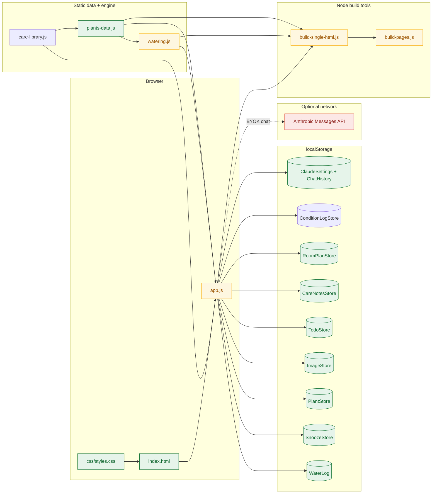
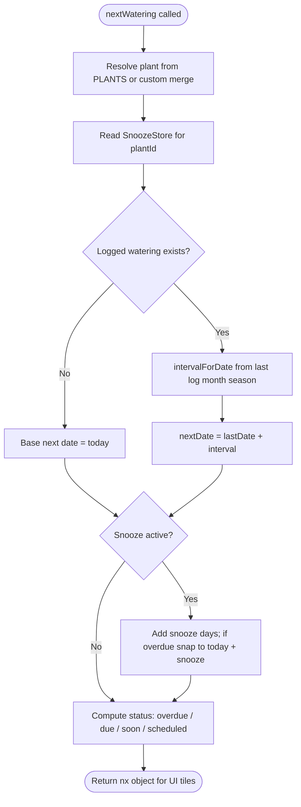
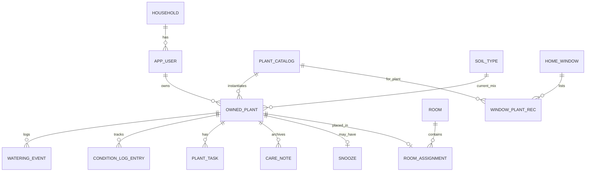

# Moose's Plant Care — developer guide

*plant-care / developer-guide-structure-and-features*

## Metadata

| Attribute | Details |
|---|---|
| Audience | Developers / maintainers (including AI coding agents) |
| Scope | Architecture, **core logic & algorithms**, data model, features, build/deploy |
| Last updated | 2026-08-14 (Aug 2026 moves: outdoor NW patio, ZZ 5", Schefflera 13.5", Mondo 9×9, corn canes split, Monstera air layers + water cuttings) |
| Owner | Personal POC — `Personal_POC/Plant_Care` |
| Companion doc | [`project-requirements-and-handoff.md`](./project-requirements-and-handoff.md) — inventory, edit recipes, session logs |

This guide explains **how the app is structured, how non-trivial client-side algorithms work, and how each feature is wired in code**. Everything in §3 ships in the GitHub Pages static bundle (`js/*.js` inlined or copied as-is). The handoff doc remains the authoritative plant inventory and agent edit cheat sheet.

---

## 1. What this app is

**Moose's Plant Care** is a fully offline-capable **static** personal plant-care web app:

- Pure **HTML + CSS + vanilla JavaScript** — no framework, no transpilation, no backend required to run.
- Tracks **40 owned plants** with research-backed care data, watering schedules, placement, soil tracking, todos, and optional BYOK Claude chat.
- Dual-themed UI: light green/leaf palette (unchanged) and a dark **"cozy den"** palette — warm brown backgrounds, golden-retriever amber primary (`#e0a94f`), soft leaf-green accent (`#8fce8f`), teal scheduled accent (`#5bc8b8`). Header/title/meta use 🐶 favicon; app renamed from "Cowboy Bebop Green House" to **Moose's Plant Care** (Moose is the owner's dog).
- Runs on desktop or phone via folder open, local HTTP server, single-file build, or GitHub Pages deploy copy.

**Source of truth:** `c:\Users\szfy8z\Personal_POC\Plant_Care\`

**Deploy copy (generated):** `c:\Users\szfy8z\Personal_POC\plant-care-site\` — synced via `tools/build-pages.js`.

---

## 2. Architecture overview



### Layer responsibilities

| Layer | File(s) | Responsibility |
|---|---|---|
| Shell | `index.html` | Tab nav, seven tab panels (Soil Mix nav tab removed), form markup, script load order |
| Presentation | `css/styles.css` | Mobile-first layout, light/dark themes via `[data-theme]`, Care Guide `details.care-section` accordions |
| Domain data | `js/plants-data.js` | `PLANTS`, `SOIL_TYPES`, `HOME_WINDOWS` / `HOME_EXPOSURES` / `PLANT_LIGHT_REF`, legacy `PLANT_PLACEMENT`, static config arrays |
| Care library | `js/care-library.js` | `CHOPSTICK_SOIL_CHECK`, propagation + troubleshooting matrices, `getPropagationMethods`, `getTroubleshootingGuide`, `CareLibrary` |
| Schedule engine | `js/watering.js` | Seasonal intervals, `nextWatering`, `buildSchedule`, `RoomPlanStore`, `ConditionLogStore`, other `*Store` persistence except images/theme |
| UI orchestration | `js/app.js` | Tab switching, every `render*()` function, Analyze tab, Claude module, import/export, gestures |
| Build | `tools/*.js` | Single-file bundle + GitHub Pages sync (Node only; not required at runtime) |

### Script load order (critical)

```html
<script src="js/plants-data.js"></script>
<script src="js/care-library.js"></script>
<script src="js/watering.js"></script>
<script src="js/app.js"></script>
```

`watering.js` expects globals from `plants-data.js`. `care-library.js` reads `plant.category` and optional plant-specific overrides but does not depend on `watering.js`. `app.js` wraps everything in an IIFE and calls `init()` on load.

---

## 3. Core logic & algorithms

This section documents the **non-trivial algorithms that run in the browser** on every visit to the GitHub Pages site. Build-time tooling is covered in **§3.10** only.

### 3.1 Three-tier seasonal watering (`nextWatering`) — `js/watering.js`

**Calibration:** `SEASONAL_CONFIG.location = "Austin, TX (indoor, 75–80°F)"`. Indoor constant temperature means hot vs warm intervals differ by ~10–15%; the larger shift is cool season (shorter daylight → longer intervals).

**Season selection** — `seasonForDate(date)` reads `MONTH_SEASONS[date.getMonth()]`:

| Index | Month | Season | Interval source |
|---|---|---|---|
| 0, 1, 11 | Jan, Feb, Dec | `cool` | `plant.wateringDaysCool` |
| 2–4, 9, 10 | Mar–May, Oct, Nov | `warm` | `plant.wateringDays` |
| 5–8 | Jun–Sep | `hot` | `plant.wateringDaysHot`, or `round(wateringDays × 0.88)` if hot missing |

**Interval pick** — `intervalForDate(plant, date)` delegates to the row above.

**`nextWatering(plantId, logEntries, explicitPlant)` step list:**

1. Resolve plant from `explicitPlant` (merged custom/overlay from `PlantStore.allPlants()`) or `PLANTS[plantId]`.
2. Early exit if no `wateringDays` / `wateringDaysCool` (custom without intervals → `{ status: "due", daysUntil: 0 }`).
3. **Read snooze once** — `SnoozeStore.get(plantId)` → `snoozeDays` (must run before both branches; see comment at L211–216).
4. Sort log entries for plant descending; take most recent as `last`.
5. **No-log branch** (`actuals.length === 0`):
   - `baseNext = today`
   - `nextNoLog = today + snoozeDays` if snoozed
   - Status: `due` if `daysUntil ≤ 0`, else `soon` if `≤ 3`, else `scheduled` (note: no `overdue` without a log)
6. **Has-log branch**:
   - `interval = intervalForDate(plant, last)` — season of **last watering date**
   - `next = last + interval`
   - If snoozed: `baseForSnooze = (next < today) ? today : next`; then `next = baseForSnooze + snoozeDays` (“don’t bug me for N days from now”)
   - `daysUntil = daysBetween(today, next)`
   - Status: `overdue` if `< 0`, `due` if `0`, `soon` if `≤ 3`, else `scheduled`
7. Return `{ lastDate, nextDate, daysUntil, status, interval, season, snooze }`.

**`buildSchedule()`** projects all of 2026 from the last log (or Jan 1 baseline). Snooze shifts only the **first** projected date; if that date is past, snap to `today + snoozeDays` (same overdue fix as `nextWatering`).

See also: [`diagrams/watering-schedule-flow.mmd`](./diagrams/watering-schedule-flow.mmd).



### 3.2 Additive snooze + scroll-safe tap gestures — `SnoozeStore` + `app.js`

**Storage** (`js/watering.js` → `SnoozeStore`):

```
Shape: { [plantId]: { addDays: number, snoozedAt: "YYYY-MM-DD" } }
SnoozeStore.add(plantId, days) → addDays += days  (additive — +3 then +4 = +7)
WaterLog.add({ plantId }) → SnoozeStore.clear(plantId)
```

**Why gesture detection exists:** Samsung Internet on Android had a history of unreliable `click` on dynamically re-rendered snooze buttons (non-first tiles). Early fix used `pointerdown`-only firing, which **snoozed on scroll** when the finger started on a button. Current design tracks a full gesture.

**Handler** (`wireSnoozeHandlers` on `#next-water-summary` and `#plant-detail` — stable parents survive `innerHTML` re-renders):

| Constant / state | Value | Role |
|---|---|---|
| `TAP_MOVE_THRESHOLD` | 10 px | Cancel gesture if finger moved (scroll, not tap) |
| `TAP_TIME_THRESHOLD` | 600 ms | Ignore long-press |
| `snoozeGesture` | `{ pointerId, btn, x, y, t }` | Active gesture tracker |
| `lastSnoozeFireAt` | timestamp | Dedupe pointerup vs click fallback (700 ms window) |

**Fire conditions** (`handleSnoozePointerUp`):

1. Same `pointerId` as `pointerdown`
2. Elapsed `< 600` ms
3. `pointerup` target is the **same** `.snooze-btn` as `pointerdown`
4. `pointermove` did not exceed 10 px; `pointercancel` / `pointerleave` did not clear state

**Fallback:** `handleSnoozeClickFallback` on `click` for keyboard/mouse; skipped if pointer path fired within 700 ms.

**No same-button debounce** — additive snooze is intentional. Only dedupe is pointerup ↔ click for one physical tap.

**On fire:** `fireSnooze()` → `SnoozeStore.add/clear` → `renderCalendar()` + `refreshPlantWateringSectionIfVisible(id)`.

### 3.3 Calendar urgency ordering + auto re-queue — `renderNextSummary()` — `app.js`

```
candidateIds = ownedIds, filtered by plant dropdown and/or "logged on" date filter
meta = candidateIds.map(pid => ({ pid, plant, nx: nextWatering(pid, log, plant) }))
meta.sort((a, b) => {
  if (a.nx.daysUntil !== b.nx.daysUntil) return a.nx.daysUntil - b.nx.daysUntil  // ASC → most overdue first
  return Intl.Collator({ sensitivity: "base", numeric: true }).compare(displayNames)
})
```

Negative `daysUntil` = overdue; zero = due today; positive = future. **No extra re-queue logic** — snooze increases `daysUntil`; logging resets the cycle from the new last date; both flow through `nextWatering()` and the sort repositions the tile on the next render.

**Quick-log "💧 Just watered"** — `handleWaterNowClick` on `#next-water-summary` and `#plant-detail` (stable parents, same pattern as snooze):

```
btn = e.target.closest(".water-now-btn")
guard: WaterLog already has entry for (plantId, today) → flash "already logged", return
WaterLog.add({ plantId, date: today })  → SnoozeStore.clear implicit via WaterLog.add
renderCalendar() + renderRecentLog() + refreshPlantWateringSectionIfVisible(id)
```

Each reminder tile from `renderWaterTileHtml()` includes the button. Double-logging the same plant on the same day is blocked.

### 3.4 Custom-plant → built-in merge — `migrateCustomToBuiltins()` + `PlantStore` — `app.js`

**Merge view** — always use `PlantStore.allPlants()`, never raw `PLANTS`:

```
merged = { ...PLANTS }
customPlants.forEach(p => merged[p.id] = p)           // user_* entries overlay keys
overlays.forEach((ov, id) => merged[id] = { ...merged[id], ...ov })  // condition, pot, soil, comments
images.forEach((url, id) => merged[id].imageDataUrl = url)
```

Built-in research fields (tips, intervals, sources) come from `PLANTS`; user edits land in overlays or custom entries only.

**Migration** (first call in `init()`, idempotent):

1. Build lookup: normalized `displayName` + all `names.common[]` → built-in id (`normalize`: lowercase, strip punctuation).
2. For each `user_*` custom where normalized name matches a built-in:
   - **Overlay patch** (only if built-in overlay field empty): `condition`, `comments`, `potSize` (if ≠ built-in default), `currentSoilMix` (if ≠ `"pending"`)
   - **Image:** move `ImageStore` from custom id → built-in id
   - **Water log:** repoint `plantId` on all entries
   - **Snooze:** migrate if built-in has none
   - **Remove** custom plant + orphan overlay
3. Toast + `console.info` on first merge.

Agent workflow: add full entry to `PLANTS` + `OWNED_PLANT_IDS`; user’s next page load auto-merges.

### 3.5 Tile name → Care Guide navigation — `openCareGuideForPlant()` — `app.js`

Care Guide uses a **two-level selector**: flat owned list + group entries `__group_succulent__` / `__group_pothos__` with sub-dropdowns for variants.

```
if plantId ∈ SUCCULENT_VARIANTS:
  primarySelect = GROUP_SUCC; populateSubSelect; subSelect = plantId
else if plantId ∈ POTHOS_VARIANTS:
  primarySelect = GROUP_POTH; populateSubSelect; subSelect = plantId
else:
  primarySelect = plantId; hide sub-dropdown
renderPlantDetail(plantId); switch to care tab; scrollIntoView(detailEl)
```

**Why three paths:** variant plants are not top-level primary options — they live under group headers to keep the main dropdown short. Calendar tile links (`.tile-name-link`, delegated on `#next-water-summary`) must resolve the same UX as manually picking from both dropdowns.

**Plant-name → Care Guide links everywhere** — `plantCareLinkHtml(pid, text)` returns a `<button class="plant-care-link" data-care-plant-id="…">` when the plant exists in `PlantStore.allPlants()`. A single document-wide delegated `click` handler on `.plant-care-link` calls `openCareGuideForPlant(pid)`. Used in: placement reference table, placement focus card heading, recent watering log, soil cards, todo chips (calendar tiles already use `.tile-name-link` with the same destination).

### 3.6 Soil recommendation engine — `evaluateSoil()` — `app.js`

Input: merged plant with `currentSoilMix` and `idealSoil[]` (keys into `SOIL_TYPES`).

```
if current === "pending"           → status pending
if current ∈ idealSoil[]           → ideal
else for each ideal type:
  RANK = { low:1, medium:2, high:3, very_high:4, controlled:2 }
  acceptable if (drainage exact AND retention within 1 step) OR (retention exact AND drainage within 1 step)
if any acceptable                  → acceptable
else                               → mismatch
```

The dual-constraint rule prevents false positives (e.g. standard potting “acceptable” for mini orchid because both share medium drainage with sphagnum).

### 3.7 Window-based placement engine — `HOME_WINDOWS` + `renderPlacementTab()` — `app.js`

The Placement tab was rebuilt around **eight real home windows** (two floors). Legacy `PLACEMENT_ZONES` / `PLANT_PLACEMENT` remain in `plants-data.js` for Claude chat context only; the tab UI reads `HOME_*` structures.

**Static data** (`plants-data.js`):

| Object | Purpose |
|---|---|
| `HOME_EXPOSURES` | Compass-direction sun primer — rendered as "☀️ What each exposure delivers at ~30°N" tiles (`renderPlacementPrimer`) |
| `HOME_WINDOWS` | Eight window/room cards — see shape below |
| `HOME_PLACEMENT_NOTES` | Special callouts (humidifier guidance, vaulted living room, ZZ repot, rot-risk succulents, etc.) |
| `PLANT_LIGHT_REF` | Per-plant light/humidity/best-window reference table; `hum: true` marks humidity-lovers (💧 in UI) |

**`HOME_WINDOWS` entry shape:**

```
{
  id, floor, name, bearing, tier, label,          // label = "2F · Room 2" floor + room type
  light, humidity,
  humidifier: { rec: "use"|"skip"|"optional"|"not-needed", note },
  thrive: [ plantId | { id, note?, back?: true } ],
  solid:  [ plantId | { id, note?, back?: true } ],
  avoid: "prose string",
  keepOut: [ plantId, ... ]                         // structured keep-out list (red highlight)
}
```

**Set-back model:** `back: true` on a thrive/solid entry marks plants best placed **4–7 ft back** from the glass (softer indirect zone). Chips show an asterisk; focus card adds "↩ set back 4–7 ft" tag; legend explains the convention.

**Humidifier guidance:** A single small portable unit only humidifies a ~2–4 ft pocket. Best home: enclosed **2F Room 2** (`humidifier.rec: "use"`). The **1F living room** is a vaulted double-height space open to 2F — mist dissipates; cards mark `skip`. Window cards show 💧/🚫 humidifier badges; humidity-lovers tagged 💧 in reference table + focus card.

**Dual filters** (mutually exclusive):

| Filter | State var | Behavior |
|---|---|---|
| 🌿 Focus on a plant | `placementFocusId` | Highlights plant across window cards + reference table; shows focus card with sorted verdicts |
| 🪟 Focus on a room | `placementRoomId` | Hides all window cards except the selected room |

Selecting one clears the other (`setPlacementFocus` / room-filter change).

**Four-state window highlighting** when focusing a plant (`applyPlacement`):

```
inThrive → win-thrive (green)
inSolid  → win-solid (blue)
in keepOut → win-avoid (red, "⛔ keep out")
else     → win-dim
```

Focus card verdict list uses the same four states, sorted: Thrive → Solid → Keep out → Not listed.

**Room planner** — see **§3.9** (`RoomPlanStore`, `#placement-roomplan`).

Rendering pipeline in `renderPlacementTab()`: primer → window cards → room plan → notes → reference table → sources → populate filters → `applyPlacement()`.

### 3.8 Claude chat client — `app.js` (+ stores in `watering.js`)

**System prompt** — `buildClaudeSystemPrompt(plantContextId)`:

- Base instructions: Austin indoor 75–80°F, concise style, use owner’s actual data.
- `"ALL"`: compact list of all owned plants + watering status from `nextWatering()`.
- Specific plant id: pot, soil, condition, comments, last log, next due, ideal placement zones, open todos, cross-reference list.
- `"NONE"`: base instructions only.

**Send pipeline** — `sendChatMessage()`:

1. `buildClaudeSystemPrompt(chatPlantContextSel.value)`
2. Build user content: optional image block + text (`CHAT_MAX_HISTORY = 30` turns trimmed via `buildApiMessagesFromHistory`)
3. `POST https://api.anthropic.com/v1/messages` with `stream: true`, header `anthropic-dangerous-direct-browser-access: true`
4. **SSE parse** — manual loop on `resp.body.getReader()`:
   - Buffer chunks; split on `\n\n`
   - Parse `data: {...}` lines
   - `message_start` → capture `input_tokens`
   - `content_block_delta` + `text_delta` → append to `assistantText`, `renderStreamingTextInto()`
   - `message_delta` → capture `output_tokens`
5. `chatComputeCost(usage, modelId)` → `(inTok/1e6)*inUSD + (outTok/1e6)*outUSD` from `CLAUDE_MODELS` in `plants-data.js`
6. Persist usage + cost on assistant message; `ChatHistory.totalCost()` in footer

**Image pipeline** — `resizeImageFile(file, maxDim, quality)`:

```
FileReader → Image → canvas scale min(maxDim/w, maxDim/h, 1) → toDataURL("image/jpeg")
Profile photos: maxDim 800, quality 0.85
Chat photos:    maxDim 1568 (CHAT_PHOTO_MAX_DIM), quality 0.82
API payload: { type: "image", source: { type: "base64", media_type, data } }
```

**BYOK security model:** Key lives only in `localStorage` on the user’s device. The “dangerous” header flags shipping a **shared** key in a public bundle — safe here because each user supplies their own key; file is personal static HTML. Not exported in JSON backup.

### 3.9 Room planner — `RoomPlanStore` — `js/watering.js`

Users create custom rooms and assign owned plants for physical-space planning. Rendered by `renderRoomPlan()` into `#placement-roomplan` (called from `renderPlacementTab()`).

**Storage key:** `plant_care_room_plan_v1`

```
Shape: {
  rooms:       [ { id, name, note, createdAt } ],
  assignments: { [plantId]: roomId }   // a plant lives in at most ONE planned room
}
```

**API:** `addRoom`, `updateRoom`, `removeRoom`, `assign`, `unassign`, `plantsIn`, `roomFor`, `replaceAll`, `clearAll`.

**UI** (`renderRoomPlan` in `app.js`; handlers on `#placement-roomplan`):

| Path | Control | Behavior |
|---|---|---|
| Create room | `#rp-create-form` — preset `#rp-room-preset` (`.rp-preset-select`) + `#rp-name` + optional `#rp-note` | Preset options = `HOME_WINDOWS` labels (e.g. "1F · Bathroom") minus rooms already in the plan, plus "＋ Create a new room…" (`__custom__`). Choosing a preset prefills `#rp-name` (user can tweak); choosing custom clears the name field. Submit → `RoomPlanStore.addRoom(name, note)`. |
| Room → plant | Each room card's `.rp-add-select` (`data-rp-add-room`) | "+ Add a plant…" lists unassigned plants → `assign(pid, roomId)` |

**🪴 Left to place** is a read-only chip list (Care Guide links via `plantCareLinkHtml` only — no per-plant room picker). Progress line tracks placed vs unassigned. Remove (✕) and delete-room (🗑) handlers unchanged. A plant still lives in at most one planned room. Included in JSON export/import as `roomPlan` key.

**CSS:** `.rp-preset-select` (plus existing `.rp-add-select`, `.rp-chip-list`, `.rp-unassigned`, `.rp-unassigned-head`, etc.).

### 3.10 Build-time artifact production — `tools/` *(not shipped in runtime JS)*

**`build-single-html.js`:**

1. Read `index.html`, `css/styles.css`, four JS files (`plants-data`, `care-library`, `watering`, `app`)
2. Replace `<link href="css/styles.css">` with inline `<style>`
3. Replace four `<script src="js/...">` tags with one `<script>` block (order: plants-data → care-library → watering → app)
4. Escape `</script>` in JS source
5. Sanity-check no relative asset refs remain
6. Write `dist/Mooses-Plant-Care.html`

**`build-pages.js`:**

1. Copy runtime files from `Plant_Care/` → sibling `plant-care-site/` per `COPIES` table (includes `js/care-library.js`)
2. Single-file build lands at `offline/Mooses-Plant-Care.html`
3. Does **not** touch `.github/`, `.nojekyll`, deploy README, or git history

### 3.11 Care library — `js/care-library.js`

Structured Care Guide extras that complement (not replace) `plant.tips.*` prose in `plants-data.js`.

| Export | Role |
|---|---|
| `CHOPSTICK_SOIL_CHECK` | Static guide: steps, reading chart, plant tips, sources — injected into the **Watering** tip tile via `renderChopstickGuideHtml()` |
| `PROPAGATION_LIBRARY` | Per-plant or per-category propagation methods with typical first-timer **success rates** |
| `TROUBLESHOOTING_LIBRARY` | Symptom → causes → fix (+ urgency) matrices, merged plant-specific + category |
| `getPropagationMethods(plant)` | Plant override → else `CATEGORY_PROPAGATION[category]` |
| `getTroubleshootingGuide(plant)` | Plant override → else category matrix |
| `CareLibrary` | Namespace object exposing chopstick data + both resolvers |

Rendering hooks in `renderPlantDetail()` (`CARE_SECTIONS` map):

| Tip key | Extra HTML helper |
|---|---|
| `watering` | `renderChopstickGuideHtml()` |
| `soil` | `renderPlantSoilCardHtml(plant)` — current vs ideal soil card (formerly Soil Mix tab) |
| `propagation` | `renderPropagationMethodsHtml(plant)` |
| `troubleshooting` | `renderTroubleshootingGuideHtml(plant)` |
| `repotting` | `renderRepotSignsHtml(plant)` — plant `repotSigns[]` moved **into** this tile |

All tip tiles use `<details class="care-section">` **without** a default `open` attribute — **collapsed by default** (including Lighting).

### 3.12 Condition log — `ConditionLogStore` — `js/watering.js`

**Storage key:** `plant_care_condition_log_v1`

```
Shape: {
  [plantId]: [
    { id, date: "YYYY-MM-DD", ts: ISO, rating, note }
  ]
}
```

**Ratings:** `PLANT_CONDITION_OPTIONS` in `app.js` — `Thriving`, `Healthy`, `Okay`, `Struggling`, `Recovering`.

**UI:** Care Guide section `🩺 Condition log` (form + history list). On submit, `handlePlantConditionLogSubmit`:

1. `ConditionLogStore.add(plantId, { date, rating, note })`
2. Updates profile `condition` via `PlantStore.setOverlay` (built-ins) or `upsertCustom` (custom plants)
3. Full `renderPlantDetail(plantId)` so the header condition badge stays in sync

Included in JSON export/import as `conditionLog`. Feeds **Analyze** tab when "Condition log" is checked.

### 3.13 Analyze tab — `js/app.js`

Main nav tab `🔎 Analyze` (`data-tab="analyze"`) sits between **Ask Claude** and **Placement**.

**Always-included context** (via `buildAnalyzePayload`): merged plant profile — pot, category, comments, `repotted`, soil evaluation (`evaluateSoil`), ideal `conditions`, `PLANT_LIGHT_REF`, `HOME_WINDOWS` thrive/solid/keepOut matches (`getPlantPlacementContext`), `RoomPlanStore` planned room.

**Optional includes** (checkboxes; at least one required): watering log, condition log, care notes, todos.

| Function | Purpose |
|---|---|
| `buildAnalyzePayload(plantId, opts)` | JSON bundle for one plant or `ALL` owned plants |
| `getPlantPlacementContext(pid)` | Light ref + window matches + planned room |
| `buildLocalAnalyzeSummary(payload)` | Offline heuristic report (watering drift, soil/placement mismatch) |
| `runAnalyzeWithClaude(payload, extraText)` | Non-streaming Anthropic call; reuses BYOK key from `ClaudeSettings` |
| `renderAnalyzeTab()` | Populate plant select; show/hide save button |

**Save:** "💾 Save result to plant notes" writes analysis text into `CareNotesStore` (same archive path as chat saves).

**Fallback:** "📋 Local summary only" when no API key or user prefers heuristics.

---

## 4. Tech stack

| Concern | Choice | Notes |
|---|---|---|
| Runtime | Browser ES5+ vanilla JS | No bundler; globals + IIFE |
| Styling | CSS custom properties | Themes via `html[data-theme]` |
| Persistence | `localStorage` | All user data; JSON export for portability |
| Calendar year | Hard-coded `YEAR = 2026` | In `watering.js` |
| Optional AI | Anthropic Messages API (SSE) | BYOK; browser-direct with official header |
| Build tools | Node.js (`fs`, `path`) | `tools/build-single-html.js`, `tools/build-pages.js` |
| Spreadsheet import | `xlsx` (dev-only) | `tools/read-plant-data.js` — one-off seeding |

---

## 5. Repository layout

```
Plant_Care/
├── index.html                          # Main page — tabs, panels, forms
├── README.md                           # User-facing run/edit guide
├── css/styles.css                      # All styling (light + dark)
├── js/
│   ├── plants-data.js                  # PLANTS + static config (primary edit target)
│   ├── care-library.js                 # Chopstick guide, propagation/troubleshooting matrices
│   ├── watering.js                     # Schedule engine + stores (incl. ConditionLogStore)
│   └── app.js                          # UI, Analyze, Claude chat, import/export
├── data/
│   ├── watering-log.json               # Empty starter template
│   ├── images/                         # Optional portable JPG photos per plantId
│   └── exported_data/                  # User JSON exports (git-ignored in deploy)
├── dist/Mooses-Plant-Care.html  # Single-file mobile build
├── docs/
│   ├── project-requirements-and-handoff.md
│   ├── developer-guide-structure-and-features.md   # this file
│   └── diagrams/                       # Mermaid sources
└── tools/
    ├── build-single-html.js
    ├── build-pages.js
    └── read-plant-data.js
```

---

## 6. Application bootstrap

On every page load, `init()` in `app.js` runs this sequence:

```mermaid
sequenceDiagram
    autonumber
    participant Browser
    participant app.js
    participant watering.js
    participant plants-data.js
    participant localStorage

    Browser->>app.js: Load scripts (plants-data → care-library → watering → app)
    app.js->>app.js: loadTheme()
    app.js->>app.js: migrateCustomToBuiltins()
    app.js->>localStorage: Read custom plants, overlays, images, log, snoozes
    app.js->>plants-data.js: Match custom displayName to built-in PLANTS
    app.js->>localStorage: Migrate overlays, images, log ids; remove custom
    app.js->>app.js: populate*Select() for all tabs
    app.js->>watering.js: nextWatering / buildSchedule for calendar
    app.js->>app.js: renderCalendar, renderPlacementTab, renderTodosTab, renderChatTab
    app.js-->>Browser: Interactive UI ready
```

**First call:** `migrateCustomToBuiltins()` — prevents duplicate `(custom)` entries after an agent promotes a user plant into `PLANTS`. Idempotent; shows a one-time toast when merges occur.

**Default tab:** `calendar` (Watering Calendar). `renderCalendar()` runs unconditionally so tiles are visible before any tab click.

---

## 7. Data model

### 7.1 Built-in plant schema (`PLANTS` in `plants-data.js`)

Every owned plant is a key in the `PLANTS` object. Required and common fields:

| Field | Type | Purpose |
|---|---|---|
| `id` | string | Must match object key |
| `displayName` | string | UI title (unique identifier only — no pot/cutting counts in title) |
| `potSize` | string | e.g. `'6.5"'` or `"Water propagation"` |
| `category` | string | Badge + category defaults for custom plants |
| `names.common` | string[] | Alternate common names |
| `names.scientific` | string | Scientific name |
| `wateringDays` | number | Warm-season interval (days) |
| `wateringDaysHot` | number | Hot-season interval (Jun–Sep) |
| `wateringDaysCool` | number | Cool-season interval (Dec–Feb) |
| `conditions` | object | `{ light, temperature, humidity, soilMoisture }` each with `ideal` + `passing` |
| `tips` | object | Eight sections: lighting, soil, watering, pruning, propagation, repotting, feeding, troubleshooting |
| `sources` | `{label, url}[]` | **Minimum 5** reputable citations per plant |
| `idealSoil` | string[] | Keys into `SOIL_TYPES` |
| `currentSoilMix` | string | User-facing default; overridden by overlay |
| `soilNotes` | string? | Optional owner/soil notes (soil status card in Care Guide → Soil tip) |
| `comments` | string? | Free-text owner notes |
| `repotSigns` | string[] | Observable repot signals — rendered inside **Repotting** tip tile (`renderRepotSignsHtml`) |
| `repotted` | boolean? | When `true`, Care Guide shows green “Repotted ✅” confirmation instead of stale `repotSuggestion` |
| `repotSuggestion` | object? | Nursery-pot plants only — urgency, target pot/soil, technique (ignored at render when `repotted: true`) |
| `isPropagation` | boolean? | Water-rooting mode |
| `cuttingsCount` | number? | Cuttings in container (propagation or multi-cutting pots) |
| `composition` | string? | e.g. pothos combo breakdown |
| `transferPlan` | object? | Water → soil graduation plan (`potSize`, `soilType`, `summary`, `alternatives[]`) |
| `isVariant` / `variantGroup` | boolean / string? | Succulent or pothos sub-dropdown grouping |

**Control arrays** (bottom of `plants-data.js`):

| Array | Controls |
|---|---|
| `OWNED_PLANT_IDS` | Which plants appear in dropdowns and calendar |
| `SUCCULENT_VARIANTS` | Sub-dropdown under “🌵 Succulents” |
| `POTHOS_VARIANTS` | Sub-dropdown under “🌿 Pothos” |
| `WATER_PROPAGATION_IDS` | Currently `[]` — schema ready for future cuttings |

### 7.2 Soil catalog (`SOIL_TYPES`)

Each soil type has `label`, `drainage`, `retention`, `description`. Used by the inline soil card in Care Guide → **Soil** tip and the Plant Profile form. Keys include `standard_potting`, `amended_potting`, `cactus_mix`, `aroid_mix`, `terrarium_mix`, `water_propagation`, `pending`, `other`, etc.

Status logic: see **§3.6** (`evaluateSoil`).

### 7.3 Placement model

| Object | Location | Shape / role |
|---|---|---|
| `HOME_EXPOSURES` | `plants-data.js` | Compass sun primer (SE/NE/SW/NW at ~30°N) |
| `HOME_WINDOWS` | `plants-data.js` | Eight real windows — light/humidity profile, humidifier rec, thrive/solid/keepOut lists |
| `HOME_PLACEMENT_NOTES` | `plants-data.js` | Callout cards (`tone`, `title`, `body`) |
| `PLANT_LIGHT_REF` | `plants-data.js` | Per-plant light/humidity/best-window; optional `hum: true` |
| `PLACEMENT_ZONES` | `plants-data.js` | Legacy eight micro-zones — **Claude chat context only** |
| `PLANT_PLACEMENT` | `plants-data.js` | Legacy per-plant ideal/ok/avoid — **Claude chat context only** |
| `PLACEMENT_SOURCES` | `plants-data.js` | Cited horticultural sources (rendered at tab bottom) |

Rendering logic: see **§3.7** and **§3.9** (room planner).

### 7.4 localStorage stores

| Store | Key | Module | Exported? |
|---|---|---|---|
| Theme | `plant_care_theme` | `app.js` | No |
| Water log | `plant_care_water_log_v1` | `watering.js` → `WaterLog` | Yes |
| Snoozes | `plant_care_snoozes_v1` | `watering.js` → `SnoozeStore` | Yes |
| Custom plants | `plant_care_custom_plants_v1` | `app.js` → `PlantStore` | Yes |
| Built-in overlays | `plant_care_plant_overlays_v1` | `app.js` → `PlantStore` | Yes |
| Photos | `plant_care_images_v1` | `app.js` → `ImageStore` | Yes |
| Todos | `plant_care_todos_v1` | `watering.js` → `TodoStore` | Yes |
| Claude settings | `plant_care_anthropic_settings_v1` | `watering.js` → `ClaudeSettings` | **No** (device-local BYOK) |
| Chat history | `plant_care_chat_history_v1` | `watering.js` → `ChatHistory` | **No** |
| Care notes | `plant_care_care_notes_v1` | `watering.js` → `CareNotesStore` | Yes |
| Condition log | `plant_care_condition_log_v1` | `watering.js` → `ConditionLogStore` | Yes |
| Room plan | `plant_care_room_plan_v1` | `watering.js` → `RoomPlanStore` | Yes |

**Overlay fields** on built-ins: `condition`, `comments`, `potSize`, `currentSoilMix`, photo (via `ImageStore`). Tips, intervals, and sources are **not** overlay-editable — edit `plants-data.js`.

**Snooze shape:** see **§3.2**.

**Todo shape:** `{ id, plantId?, title, category, dueDate?, notes?, completedAt?, createdAt }`.

**Care note shape:** `{ id, plantId, title, text, source, model, createdAt }` — archived from Claude chat.

### 7.5 JSON export / import

Export payload (Log & Data tab):

```js
{
  waterLog, customPlants, overlays, images,
  snoozes, todos, careNotes, conditionLog, roomPlan, exportedAt
}
```

Import accepts a bare array (legacy water log only) or the full object. Claude API key and chat history are intentionally excluded.

---

## 8. Watering schedule engine (reference)

Full algorithm: **§3.1**. Core API surface in `js/watering.js`:

| Function | Returns | Used by |
|---|---|---|
| `intervalForDate(plant, date)` | Days for that month’s season | Schedule projection |
| `buildSchedule(plantId, log, plant?)` | `{date, type}[]` for 2026 | Calendar grid |
| `nextWatering(plantId, log, plant?)` | `{ lastDate, nextDate, daysUntil, status, interval }` | Watering tiles |
| `Dates.*` | ISO/pretty date helpers | All tabs |

Intervals are research-based, not user-editable. Snooze + calendar projection: **§3.1**, **§3.2**, **§3.3**.

---

## 9. UI architecture

### 9.1 Tab system

Seven tabs in `index.html` nav; `data-tab` attribute drives switching in `app.js`. The standalone **🪴 Soil Mix** nav tab was removed — soil status lives in Care Guide → **Soil** tip (`renderPlantSoilCardHtml`).

| Tab id | Label | Default? | Primary render function |
|---|---|---|---|
| `calendar` | 📅 Watering Calendar | **Yes** | `renderCalendar()` |
| `todos` | ✅ Todos | | `renderTodosTab()` |
| `care` | 📖 Care Guide | | `renderPlantDetail()` |
| `chat` | 🤖 Ask Claude | | `renderChatTab()` |
| `analyze` | 🔎 Analyze | | `renderAnalyzeTab()` |
| `placement` | 📍 Placement | | `renderPlacementTab()` |
| `log` | 💧 Log & Data | | `renderRecentLog()` |

Tab activation re-renders the target tab (lazy refresh pattern).

### 9.2 Shared watering tile — `renderWaterTileHtml()`

Single helper in `app.js` renders the 💧 next-watering card for:

- Calendar tab — `renderNextSummary()` — urgency sort per **§3.3**
- Care Guide — `renderPlantWateringSection()` with `{ includeName: false }`

Each tile includes status badge, last/next dates, snooze shift line, snooze buttons, **💧 Just watered** quick-log button (`.water-now-btn`), and `.tile-name-link` → **§3.5**.

### 9.3 Cross-tab navigation helpers

| Function | Behavior |
|---|---|
| `openCareGuideForPlant(plantId)` | Three-way selector resolution — **§3.5** |
| `plantCareLinkHtml(pid, text)` | Inline tappable plant name → Care Guide — **§3.5** |
| `openChatForPlant(plantId)` | Pre-selects plant context in Claude tab; focuses input |
| `openTodosForPlant(plantId)` | Sets todo filter; switches to Todos tab |
| `openPlantProfileForSoil(plantId)` | Log tab → Plant Profile edit, focus soil dropdown (from inline soil card) |

### 9.4 Snooze gesture handling

Full algorithm: **§3.2**. Handlers wired once on stable `#next-water-summary` and `#plant-detail` parents.

### 9.5 Care Guide render pipeline (`renderPlantDetail`)

Renders in order:

1. Meta header (pot, cuttings, condition, category)
2. Photo (folder `data/images/<id>.jpg` first, then `ImageStore` fallback)
3. 💧 Next watering tile + inline log form (shared helper)
4. 🩺 Condition log (form + history; syncs overlay `condition` badge)
5. 🪴 Repot card — **`repotted: true` first** → green confirmation; else `repotSuggestion` nursery card
6. Todos strip + action pills (todos manage, Ask Claude)
7. Notes from past chats (`CareNotesStore`)
8. 📦 Transfer plan (water propagations only)
9. Conditions card (ideal vs passing)
10. Tip accordions (`CARE_SECTIONS`) — **collapsed `<details>`**; each may include Care Library extras (§3.11): chopstick guide, inline soil card, propagation table, troubleshooting matrix, inline repot signs
11. Sources list

`CARE_SECTIONS` controls tip section order, labels, and icons. Adding a new tip type requires updating every plant **and** this array (and optionally `care-library.js` for structured extras).

---

## 10. Feature deep dives (by tab)

| Tab | Key behavior | Primary code |
|---|---|---|
| **📅 Calendar** | Urgency sort §3.3; snooze §3.2; quick-log §3.3; `nextWatering` §3.1 | `renderCalendar`, `renderNextSummary`, `handleWaterNowClick` |
| **✅ Todos** | 10 categories; filter/sort by urgency; plant chips link via `plantCareLinkHtml` | `TodoStore`, `renderTodosTab` |
| **📖 Care Guide** | Variant selectors §3.5; collapsed tip tiles + Care Library §3.11; condition log §3.12; inline soil card | `renderPlantDetail`, `care-library.js` |
| **🤖 Ask Claude** | System prompt, SSE, cost §3.8 | `sendChatMessage`, `buildClaudeSystemPrompt` |
| **🔎 Analyze** | Profile + placement context; optional logs; Claude or local summary §3.13 | `buildAnalyzePayload`, `runAnalyzeWithClaude` |
| **📍 Placement** | Window cards §3.7; dual filters; room planner §3.9 | `renderPlacementTab`, `RoomPlanStore` |
| **💧 Log & Data** | Profile CRUD; merge §3.4; JSON import/export incl. `conditionLog`, `roomPlan` | `PlantStore`, export handler |

---

## 11. Theming

- Toggle: `#theme-toggle` in header.
- Storage: `localStorage.plant_care_theme`.
- Implementation: CSS variables under `[data-theme="light"]` (default) and `[data-theme="dark"]` on `<html>`.
- **Light** — green/leaf palette (unchanged).
- **Dark — "cozy den" (Moose)** — warm brown/near-black backgrounds; `--primary: #e0a94f` (golden-retriever amber), `--accent: #8fce8f` (soft leaf green), `--scheduled: #5bc8b8` (teal). Replaces the former Cowboy Bebop navy/hot-pink/yellow/cyan palette.
- **Repot card accents** — `.repot-suggestion-card.urgency-done` (green confirmation for `repotted: true` plants) plus a dark-theme variant; sits alongside existing `.urgency-urgent|soon|seasonal` nursery-recommendation accents.
- Third theme: add another `[data-theme="xxx"]` block in `css/styles.css`.

---

## 12. Build and deploy

Full build algorithms: **§3.10**.

### Single-file build (mobile)

```bash
cd Plant_Care
node tools/build-single-html.js
```

Output: `dist/Mooses-Plant-Care.html` — inlines CSS + all four JS files into one HTML document. Escapes `</script>` in source. No relative asset paths. As of 2026-08-04 the bundle is ~802 KB (Care Library matrices + expanded tips).

**Caveats:** no `data/watering-log.json` template load; no folder photo fallback; localStorage still holds user data.

### GitHub Pages sync

```bash
node tools/build-single-html.js   # refresh single-file first
node tools/build-pages.js         # copy runtime files to plant-care-site/
```

Copies: `index.html`, `css/`, `js/` (including `care-library.js`), `data/watering-log.json`, `data/images/README.md`, single-file → `offline/Mooses-Plant-Care.html`.

Does **not** overwrite deploy scaffolding (`.github/workflows/deploy.yml`, `.nojekyll`, `README.md`, `SYNC.md`).

Then from `plant-care-site/`:

```bash
git add . && git commit -m "Update site" && git push
```

---

## 13. Conventions for maintainers

| Rule | Detail |
|---|---|
| No runtime dependencies | Site must open via `file://` or basic HTTP |
| No transpilation | Plain `.js` only |
| Project files stay under `Personal_POC/` | Do not move docs to `Summary_Learnings` for this project |
| Mobile-first | Test at ≤380px width |
| Accessibility | `role="tablist"`, `role="tabpanel"`, labeled selects |
| 5+ sources per plant | Mo Bot, RHS, `.edu` extensions, ASPCA for toxicity, The Spruce, Bonsai Empire, etc. |
| Care-tip depth | `tips.watering` / `tips.troubleshooting` should reference Central Texas (Pflugerville) indoor climate, home window placement (`HOME_WINDOWS` / `PLANT_LIGHT_REF`), pot-size-aware cadence, and end troubleshooting with an ASPCA-grounded pet-toxicity line where applicable. Links belong in `sources[]` (tip text renders escaped plain text). |
| Repot confirmation | Set `repotted: true` + update `potSize`, `currentSoilMix`, `comments`, `soilNotes` when a nursery plant is repotted; stale `repotSuggestion` may remain in data but render is gated on `repotted` first |
| Intervals are authoritative | Edit `plants-data.js`, not user form |
| Promote customs to built-ins | Add full `PLANTS` entry; **§3.4** handles cleanup on next load |
| After pot-size changes | Re-research intervals in `plants-data.js`; rebuild single-file |
| Display names | Unique identifier only; pot/cuttings live in meta rows |

### Common extension points

| Task | Where to edit |
|---|---|
| Add owned plant | `PLANTS`, `OWNED_PLANT_IDS`, optionally variant arrays |
| New tab | `index.html` nav + panel, `app.js` tab switch + render |
| New soil type | `SOIL_TYPES`, then plant `idealSoil[]` entries |
| New todo category | `TODO_CATEGORIES` |
| New placement window | `HOME_WINDOWS` entry + update `PLANT_LIGHT_REF`; optionally `keepOut` / thrive/solid lists |
| New custom room type | User-facing via Room planner UI; no code change unless default seed data needed |
| Recalibrate climate | `SEASONAL_CONFIG` in `watering.js` |

---

## 14. Recommended data model for a Spring REST backend

This section maps today's **static catalog + localStorage** design to a relational schema suitable for **Spring Boot 3 REST**, **PostgreSQL** (recommended primary store), and a **React or Angular SPA**. MongoDB can hold the same shapes as nested documents (`PlantCatalog.tips`, troubleshooting matrices) if the team prefers document-first catalog seeding — but normalize **user-mutable events** (waterings, condition logs, todos) for queryability and sync.

### 14.1 Design principles

| Principle | Static app today | Production REST app |
|---|---|---|
| Catalog vs instance | `PLANTS` + `care-library.js` + `HOME_*` are read-mostly | Seed `plant_catalog`, `soil_type`, `home_window`, propagation/troubleshooting tables from JS exports |
| User data | Per-browser localStorage keys | Rows scoped by `user_id` / `household_id` |
| AI secrets | BYOK in `localStorage` | Anthropic key on server (env) or encrypted per-user BYOK — **never** long-term in browser storage for multi-user |
| Auth | None | JWT (stateless SPA) or session cookie + CSRF; household membership for shared collections |
| Photos | base64 in `ImageStore` | Object storage (S3-compatible) + `plant_photo` metadata |

### 14.2 Entity overview (ER)

See also: [`diagrams/spring-rest-er.mmd`](./diagrams/spring-rest-er.mmd).



### 14.3 Entities (fields, keys, catalog vs mutable)

| Entity | PK | Key fields | FKs / indexes | Catalog (seed) vs user-mutable |
|---|---|---|---|---|
| **Household** | `id` UUID | `name`, `timezone`, `created_at` | — | Mutable (admin) |
| **AppUser** | `id` UUID | `email`, `password_hash` or `oauth_sub`, `display_name` | `household_id` | Mutable |
| **PlantCatalog** | `slug` VARCHAR | `display_name`, `category`, `scientific_name`, `watering_days_warm/hot/cool`, JSONB `conditions`, JSONB `tips`, JSONB `sources`, JSONB `repot_signs`, JSONB `repot_suggestion`, flags (`is_propagation`, …) | Index on `category` | **Catalog** — seed from `plants-data.js` |
| **PropagationMethod** | `id` UUID | `catalog_slug`, `method`, `success_rate`, `timeline`, `notes`, `sort_order` | FK `catalog_slug` → PlantCatalog; fallback rows with `catalog_slug = NULL` + `category` | **Catalog** — seed from `PROPAGATION_LIBRARY` / `CATEGORY_PROPAGATION` |
| **TroubleshootingRow** | `id` UUID | `catalog_slug` or `category`, `symptom`, `causes`, `fix`, `urgency` | Index `(catalog_slug)`, `(category)` | **Catalog** — seed from `TROUBLESHOOTING_LIBRARY` |
| **ChopstickGuide** | singleton or version row | JSONB matching `CHOPSTICK_SOIL_CHECK` | — | **Catalog** |
| **SoilType** | `key` VARCHAR | `label`, `drainage`, `retention`, `description` | — | **Catalog** — `SOIL_TYPES` |
| **PlantIdealSoil** | `(catalog_slug, soil_key)` | — | FKs to catalog + soil | **Catalog** |
| **HomeWindow** | `id` VARCHAR | `floor`, `name`, `bearing`, `light`, `humidity`, humidifier JSON, `avoid` prose | — | **Catalog** — `HOME_WINDOWS` |
| **WindowPlantRec** | `id` UUID | `window_id`, `catalog_slug`, `match` (`thrive`\|`solid`\|`keep_out`), `set_back`, `note` | Index `(catalog_slug, match)` | **Catalog** |
| **PlantLightRef** | `catalog_slug` PK | `light`, `humidity`, `best`, `humidifier_flag` | — | **Catalog** — `PLANT_LIGHT_REF` |
| **OwnedPlant** | `id` UUID | `custom_display_name` (optional), `pot_size`, `current_soil_key`, `condition_rating`, `comments`, `cuttings_count`, `repotted`, `photo_url`, `is_custom` | FK `user_id`, FK `catalog_slug` (nullable for fully custom), index `(user_id)` | **User** — merges `PlantStore` overlays + custom plants |
| **WateringEvent** | `id` UUID | `watered_on` DATE, `note` | FK `owned_plant_id`, index `(owned_plant_id, watered_on DESC)` | **User** — `WaterLog` |
| **ConditionLogEntry** | `id` UUID | `logged_on`, `rating` ENUM, `note`, `created_at` | FK `owned_plant_id`, index `(owned_plant_id, logged_on DESC)` | **User** — `ConditionLogStore` |
| **PlantTask** | `id` UUID | `title`, `category`, `due_date`, `notes`, `completed_at`, `created_at` | FK `owned_plant_id` nullable, index `(user_id, completed_at)` | **User** — `TodoStore` |
| **CareNote** | `id` UUID | `title`, `source`, `model`, JSONB `messages`, `created_at` | FK `owned_plant_id` | **User** — `CareNotesStore` |
| **Snooze** | `owned_plant_id` PK | `add_days`, `snoozed_at` | FK `owned_plant_id` | **User** — `SnoozeStore` |
| **Room** | `id` UUID | `name`, `note`, `created_at` | FK `household_id` | **User** — `RoomPlanStore.rooms` |
| **RoomAssignment** | `(room_id, owned_plant_id)` | — | FKs; unique on `owned_plant_id` (one room per plant) | **User** |
| **AiAnalysisRun** (optional) | `id` UUID | `prompt_version`, JSONB `payload`, `result_text`, `model`, `cost_usd`, `created_at` | FK `user_id`, FK `owned_plant_id` nullable | **User** — server-side audit of Analyze tab |
| **ChatMessage** (optional) | `id` UUID | `role`, `content`, `tokens`, `created_at` | FK `conversation_id` | **User** — if chat history moves server-side |

**OwnedPlant ↔ catalog:** Built-ins reference `catalog_slug = prayer_plant`, etc. User overlays (`condition`, `potSize`, `currentSoilMix`, `comments`) become columns on `OwnedPlant`. Custom plants (`user_*`) either get their own catalog row on promote or store JSONB `custom_care` until promoted.

### 14.4 Suggested REST resource sketch

Base path `/api/v1`. All routes require auth unless noted.

| Resource | Endpoints | Maps from |
|---|---|---|
| Catalog | `GET /catalog/plants`, `GET /catalog/plants/{slug}`, `GET /catalog/soil-types`, `GET /catalog/windows` | `PLANTS`, `SOIL_TYPES`, `HOME_*` |
| Plants | `GET/POST /plants`, `GET/PATCH/DELETE /plants/{id}` | Owned instances |
| Waterings | `GET/POST /plants/{id}/waterings`, `DELETE /plants/{id}/waterings/{eventId}` | `WaterLog` |
| Conditions | `GET/POST /plants/{id}/conditions`, `DELETE .../{entryId}` | `ConditionLogStore` |
| Todos | `GET/POST /todos`, `PATCH /todos/{id}` | `TodoStore` |
| Notes | `GET/POST /plants/{id}/notes`, `DELETE /notes/{id}` | `CareNotesStore` |
| Snooze | `PUT /plants/{id}/snooze`, `DELETE /plants/{id}/snooze` | `SnoozeStore` |
| Rooms | `GET/POST /rooms`, `PUT /rooms/{id}/assignments/{plantId}` | `RoomPlanStore` |
| Analyze | `POST /plants/{id}/analyze` (body: include flags + extra text) | `runAnalyzeWithClaude` — **API key on server** |
| Export | `GET /me/export` | Full JSON export shape |
| Import | `POST /me/import` | Idempotent merge like client import |

Schedule endpoints (`GET /plants/{id}/next-watering`) can wrap the same `nextWatering` logic porting `intervalForDate` / snooze rules to Java.

### 14.5 Auth and Claude API handling

- **JWT:** SPA stores access token in memory; refresh via HttpOnly cookie or short-lived refresh token rotation.
- **Household sync:** `OwnedPlant.household_id` lets multiple devices share one collection without merging localStorage manually.
- **Claude:** Production should call Anthropic from a Spring `@Service` using a server secret or per-user encrypted BYOK table. The browser-direct BYOK + `anthropic-dangerous-direct-browser-access` pattern is acceptable for this personal static POC only.
- **Analyze payload:** Server rebuilds the same JSON structure as `buildAnalyzePayload` so the SPA does not send unverified client-only fields.

### 14.6 Migration: localStorage JSON export → PostgreSQL

1. User exports JSON from Log & Data (`waterLog`, `customPlants`, `overlays`, `images`, `snoozes`, `todos`, `careNotes`, `conditionLog`, `roomPlan`).
2. Import job (CLI or `POST /me/import`):
   - **Catalog** already seeded — match `plantId` / overlay keys to `catalog_slug`.
   - For each owned plant id in export: upsert `OwnedPlant` (pot, soil, condition from overlay merge).
   - Insert `WateringEvent`, `ConditionLogEntry`, `PlantTask`, `CareNote` rows preserving dates.
   - Map `snoozes[plantId]` → `Snooze` row.
   - Map `roomPlan.rooms` + `assignments` → `Room` + `RoomAssignment` (resolve plant ids to new UUIDs via slug map).
   - **Images:** decode base64 from export → upload to object storage; store URL on `OwnedPlant`.
3. Skip `ClaudeSettings` / chat history (device-local by design) unless user opts into server chat migration.
4. Validate: recompute next-watering for a sample plant and compare to static app.

---

## 15. Relationship to other docs

| Document | Use when |
|---|---|
| **This guide** | Understanding code structure, data flow, feature wiring, future REST schema |
| [`project-requirements-and-handoff.md`](./project-requirements-and-handoff.md) | Plant inventory, full schema examples, agent edit recipes, session history |
| [`README.md`](../README.md) | End-user how-to-run and feature summary |
| [`plant-care-site/SYNC.md`](../../plant-care-site/SYNC.md) | Deploy folder sync notes (if present) |

---

## Sources consulted

- `c:\Users\szfy8z\Personal_POC\Plant_Care\js\care-library.js` — `CHOPSTICK_SOIL_CHECK`, `getPropagationMethods`, `getTroubleshootingGuide`, `CareLibrary`
- `c:\Users\szfy8z\Personal_POC\Plant_Care\js\watering.js` — `SEASONAL_CONFIG`, `nextWatering`, `SnoozeStore`, `RoomPlanStore`, `ConditionLogStore`, `buildSchedule`
- `c:\Users\szfy8z\Personal_POC\Plant_Care\js\app.js` — Care Guide render, Analyze tab (`buildAnalyzePayload`, `runAnalyzeWithClaude`), merge, soil (`evaluateSoil`, `renderPlantSoilCardHtml`), placement, chat, snooze, export/import
- `c:\Users\szfy8z\Personal_POC\Plant_Care\js\plants-data.js` — `HOME_WINDOWS`, `HOME_EXPOSURES`, `PLANT_LIGHT_REF`, `PLANT_CONDITION_OPTIONS`, `CLAUDE_MODELS`
- `c:\Users\szfy8z\Personal_POC\Plant_Care\css\styles.css` — `.care-section`, cozy den dark-theme tokens
- `c:\Users\szfy8z\Personal_POC\Plant_Care\index.html` — tab nav (Analyze; no Soil tab), script order
- `c:\Users\szfy8z\Personal_POC\Plant_Care\tools\build-single-html.js`, `build-pages.js` — four-file bundle + Pages sync
- `c:\Users\szfy8z\Personal_POC\Plant_Care\dist\Mooses-Plant-Care.html` — ~802 KB single-file bundle (2026-08-04)
- `c:\Users\szfy8z\Personal_POC\Plant_Care\docs\project-requirements-and-handoff.md` — validated behavior cross-check
